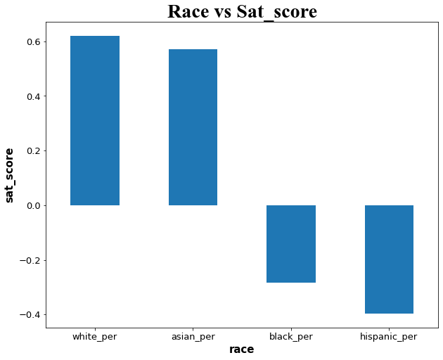

# Analyzing New York City (NYC) High School Data.

 An in depth analysis of [__SAT scores__](https://en.wikipedia.org/wiki/SAT) and whether it has any correlation to other factors used for school applicants.
 
## Motivation
I did this project in order to show my competency in exploratory data analysis, whilst using python and jupyter notebooks.
##  Built With
- Python (__3.7.11__)
- Jupyter Notebook (__6.4.6__)
- Pandas (__1.3.4__)
- Matplotlib (__3.5.0__)
- Numpy (__1.21.2__)
## Links
- [Repo](https://github.com/Tim-Agesa/analyzing-nyc-high-school-data "<analyzing-nyc-school-data> Repo")
- [Jupyter Notebook](https://github.com/Tim-Agesa/analyzing-nyc-high-school-data/blob/master/Analyzing_NYC_HighSchool_Data.ipynb)

## Work Flows of This Project

- Outlining the purpose of the project.
- Cleaning and Understanding the Data.
- Combining various data sources.
- Analyzing and Visualizing the Data.

## Screenshots

An Example of an analysis between sat scores vs race.

## Author

**Tim Agesa**

- [Profile](https://github.com/Tim-Agesa "@TimAgesa")
- [Email](mailto:agesatim@gmail.com?subject=Hi "Hi!")

## 🤝 Support

Any feedback or support is welcome. For support you can reach out at [Email](mailto:agesatim@gmail.com?subject=Hi "Hi!").

